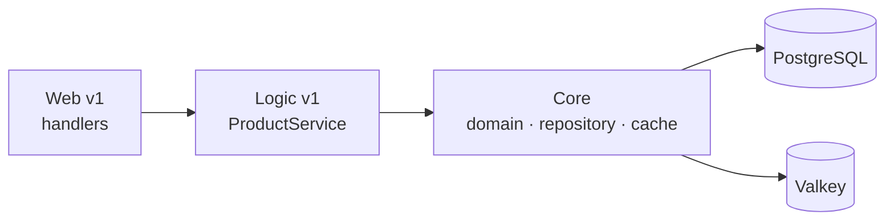

# AGENTS.md

Agent-focused contributor guide for `product-service`. Read this before making
changes. Keep edits surgical and match existing patterns.

## Contribution workflow

- **Never push to `main`.** Branch, open a PR, let CI gate the merge.
- Branch names use conventional prefixes: `feat/`, `fix/`, `docs/`, `chore/`,
  `refactor/`.
- PRs are **squash-merged** — keep the branch focused on one change.
- Commit subjects: ≤ 50 chars, imperative mood, capitalised, no trailing period
  (`Move review summary into logic layer`).
- Commit body (only when non-trivial): wrap at 72 chars, explain *what* and
  *why*, one blank line after the subject.
- **No attribution trailers** (`Signed-off-by`, `Co-authored-by`,
  `Generated-by`, …). **No** issue references (`Fixes #123`) and **no**
  `@`-mentions in commit messages — put those in the PR description.

## Code quality

- Idiomatic Go; follow existing patterns over personal preference.
- Pass `ctx context.Context` as the first argument; never store it on a struct.
- Wrap errors with `fmt.Errorf("...: %w", err)`; use `errors.New` when there is
  no format verb (`perfsprint`). Domain errors live in `internal/.../errors.go`
  and are compared with `errors.Is`.
- Always check returned errors (`errcheck`); use `_ =` only with intent.
- Inject dependencies via constructors (see `NewProductService`,
  `NewProductHandler`); optional deps (cache, review client) are nilable.
- Use `net.JoinHostPort` for host:port, `http.NewRequestWithContext` for
  outbound calls, and extract repeated literals to constants (`goconst`).
- Tests are table-driven; CI runs them with `-race`.

## Project overview

Product catalog microservice for the `duynhlab` platform. Module path
`github.com/duynhlab/product-service` (Go 1.26). It serves product listings,
single-product reads, and an aggregated product-details endpoint backed by
Valkey caching. It is a gRPC **client only** (no gRPC server): the details
endpoint calls `review-service` over gRPC to enrich a product with its reviews.

## Repository layout

```
product-service/
├── cmd/main.go                       # wiring, middleware, graceful shutdown
├── config/config.go                  # env-driven config + validation
├── db/migrations/                    # Flyway migrations + Dockerfile + .trivyignore
│   └── sql/                          # V1..Vn schema/seed
├── internal/
│   ├── web/v1/                       # HTTP handlers, DTO mapping, gRPC review client
│   │   ├── handler.go                # Gin handlers, response assembly
│   │   └── review_client.go          # gRPC ReviewClient (transport only)
│   ├── logic/v1/                     # business rules + cache-aside (NO SQL, NO gin)
│   │   ├── service.go                # ProductService: list/get/create/related
│   │   ├── details.go                # GetProductDetails aggregation + ReviewFetcher
│   │   └── errors.go                 # domain-level logic errors
│   └── core/                         # domain, repositories, DB, cache
│       ├── domain/                   # models + repository interfaces
│       ├── repository/               # pgx/v5 PostgreSQL implementations (SQL lives here)
│       ├── database.go               # pgx connection pool
│       └── cache/                    # Valkey (go-redis/v9) cache-aside client
└── middleware/                       # CORS, tracing, logging, prometheus, profiling
```

## Build, test, lint

```bash
GOTOOLCHAIN=auto go build ./...        # compile
GOTOOLCHAIN=auto go vet ./...          # vet
GOTOOLCHAIN=auto go test ./...         # tests (CI adds -race)
golangci-lint run                      # lint (v2, config in .golangci.yml)
```

Lint must pass — the `go-check` CI job rejects PRs with lint errors. `GOTOOLCHAIN=auto`
lets the local toolchain match the `go 1.26.x` directive in `go.mod`.

## Conventions

### Three-layer architecture

Strict, one-way dependency: **Web → Logic → Core**. Violations are rejected in
review.

- **Web** (`internal/web/v1/`): HTTP handling, JSON binding, DTO mapping, error
  → status translation, response assembly. No SQL, no business rules.
- **Logic** (`internal/logic/v1/`): business rules, cache-aside, cross-service
  aggregation. No SQL, no `database.GetPool()`, no `gin`, no `*gin.Context`.
- **Core** (`internal/core/`): domain models, repository interfaces +
  implementations (SQL lives here), DB pool, cache client. Imports nothing from
  Web or Logic.



### gRPC review aggregation (this service is a CLIENT)

The product-details endpoint (`GET /product/v1/public/products/:id/details`)
aggregates reviews from `review-service`.

- Aggregation lives in the **Logic** layer: `ProductService.GetProductDetails`
  (`internal/logic/v1/details.go`) composes product + related products + reviews
  and computes the summary via `ComputeReviewsSummary`.
- gRPC **transport stays in Web**: `ReviewClient` (`review_client.go`) calls
  `review.v1.ReviewService/GetProductReviews` and maps the proto to the local
  `logicv1.Review`. It is injected into Logic through the `ReviewFetcher`
  interface, so Logic never imports gRPC.
- Target: `REVIEW_GRPC_ADDR` (default `dns:///review.review.svc.cluster.local:9090`),
  dialed via `grpcx.Dial` (otelgrpc client stats handler). Per-call deadline 3s.
- **Soft-fail:** if the review client is nil or the call errors, details return
  with an empty review list and a zeroed summary — the product still loads.

### Cache-Aside (Valkey)

- Read paths (`ListProducts`, `GetProduct`) use cache-aside in the Logic layer
  via `core/cache`. `GetProduct` uses `GetProductOrSet` with **stampede
  prevention** (SETNX lock) so only one request hits the DB on a miss.
- `CreateProduct` invalidates the list cache after a successful write.
- Cache is optional: when `CACHE_ENABLED=false` (or init fails) the service runs
  with `productCache == nil` and goes straight to the repository.

### Observability (`pkg/obsx`)

- `obsx.SetupMetrics()` (in `main.go`) bridges otelgrpc client metrics into the
  default Prometheus registry, so **gRPC client RED metrics (`rpc_client_*`)
  surface on the existing `/metrics` endpoint** — no separate port.
- `LoggingMiddleware` correlates logs to traces with
  `obsx.TraceIDFromContext`.
- HTTP middleware order: **CORS → tracing → logging → metrics**
  (tracing first for context propagation; logging before Prometheus).
- Spans are opened with `middleware.StartSpan`, tagged with a `layer` attribute
  (`web` / `logic`).

### Diagrams

All diagrams MUST be Mermaid. Never ASCII art.

## Gotchas

- **Review aggregation is soft-fail** — do not turn a review-service outage into
  a product-details 5xx. Preserve the empty-list + zero-summary fallback.
- **Cache TTLs** differ: product list `5m` (`CACHE_TTL_PRODUCT_LIST`), single
  product/detail `10m` (`CACHE_TTL_PRODUCT_DETAIL`). Don't conflate them.
- **Kyverno image rules:** container images must be
  `ghcr.io/duynhlab/<service>:<sha|vX.Y.Z>` — **never `:latest`**.
- **Flyway `.trivyignore`:** `db/migrations/.trivyignore` whitelists upstream
  CVEs in the bundled Flyway image that cannot be fixed locally. Add new upstream
  ignores there with a dated comment and re-check on Flyway upgrades; do not
  silence findings elsewhere.
- `internal` routes (e.g. `POST /product/v1/internal/products`) are reachable
  only via in-cluster service DNS — never expose them on the gateway.

## API reference

Routes mount directly at `/{service}/v1/{audience}/…` (single URL shape for
browser and in-cluster callers; Kong is pass-through).

| Method | Path | Audience | Notes |
|--------|------|----------|-------|
| `GET` | `/product/v1/public/products` | public | List products (cached) |
| `GET` | `/product/v1/public/products/:id` | public | Get product (cached) |
| `GET` | `/product/v1/public/products/:id/details` | public | Aggregated product + reviews |
| `POST` | `/product/v1/internal/products` | internal | Create product (admin/seed; invalidates cache) |

Full inventory: [`homelab/docs/api/api-naming-convention.md`](https://github.com/duynhlab/homelab/blob/main/docs/api/api-naming-convention.md).
